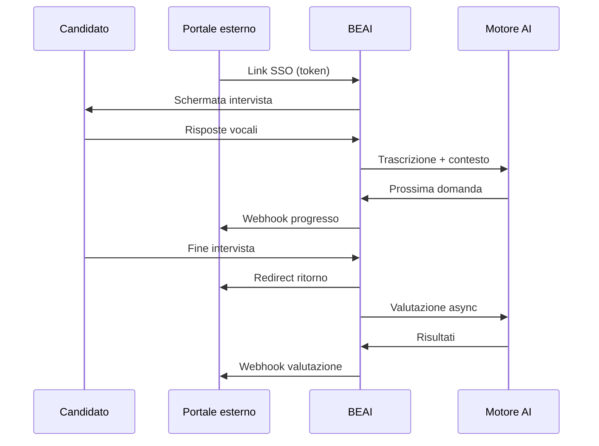

# Flussi utente

## Flusso candidato — intervista completa

### 1. Ingresso

Il candidato arriva da un sistema esterno (portale HR, LMS, email) tramite **link sicuro** che identifica:
- il candidato (identificativo opaco);
- il progetto / campagna;
- il ruolo organizzativo;
- la lingua.

Se il candidato non esiste ancora nel sistema, viene **creato al volo** al primo accesso.

### 2. Preparazione

- Richiesta permesso microfono;
- Selezione dispositivo audio;
- Eventuali messaggi di benvenuto / suggerimenti (vedi `03-ux-reference/01-messaggi-in-app.md`).

### 3. Avvio intervista

Il sistema carica:
- profilo del ruolo;
- competenze da valutare (secondo configurazione progetto);
- prima domanda, letta con voce sintetica in streaming.

### 4. Conversazione adattiva

Per ogni risposta del candidato:
1. Trascrizione vocale → testo;
2. Analisi AI della risposta;
3. Decisione:
   - **Approfondire** — domanda di follow-up sulla stessa competenza;
   - **Proseguire** — passa alla competenza successiva.

Durante questo ciclo il sistema può inviare **notifiche di progresso** verso l'esterno.

### 5. Pause e supporto

- **Pause automatiche** tra competenze (configurabili: ogni N competenze);
- **Nudge vocali** se la risposta è troppo breve, per incoraggiare approfondimento.

### 6. Chiusura

- Fine intervista;
- Avvio job asincrono di valutazione;
- Redirect verso URL di ritorno configurato (sistema chiamante).

### 7. Valutazione (asincrona)

- Analisi trascrizione completa vs scale BARS;
- Produzione punteggi per competenza;
- Notifica risultato verso sistema esterno;
- Disponibilità in pannello admin.

**Tempi attesi:** pochi minuti dalla chiusura intervista.

---

## Flusso amministratore

### Setup iniziale

1. Creare **Azienda** (tenant cliente);
2. Creare **Progetto** con ruolo, competenze, lingua, opzioni UX, tipo assessment;
3. Creare **Candidati** o abilitare ingresso via SSO esterno.

### Monitoraggio

- Vista stato candidati: in attesa → in corso → in valutazione → completato (o errore);
- Download trascrizioni e valutazioni;
- Rigenerazione link per candidati che necessitano nuovo accesso.

### Post-valutazione

- Consultazione report per competenza;
- Export dati;
- Gestione retry (se valutazione in stato "da integrare" — vedi regole di business).

---

## Flusso integrazione esterna (alto livello)

```
Sistema chiamante                    BEAI                         Sistema chiamante
      │                                │                                │
      │── genera link SSO ────────────►│                                │
      │                                │── candidato fa intervista ────►│
      │◄── webhook progresso ──────────│                                │
      │                                │── redirect fine test ─────────►│
      │◄── webhook valutazione ────────│                                │
```

Dettaglio astratto delle integrazioni: cartella `04-integration-surface/`.

---

## Diagramma sintetico


